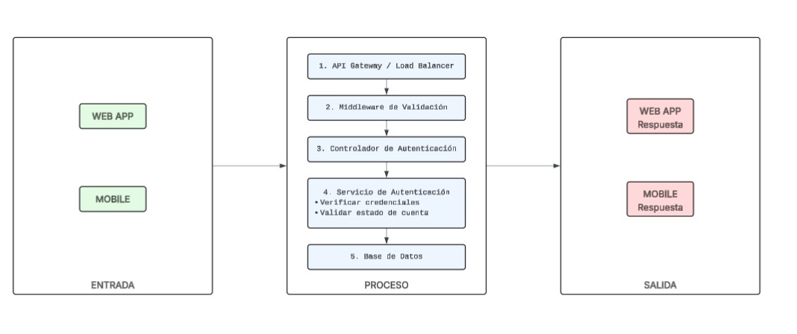

# 1. Arquitectura General - Sistema de Login Culqui

## Flujo: Entrada → Proceso → Salida

### ENTRADA (Input Layer)
**Canales de Acceso:**
- **Web App (Navegador):** Formulario de login con usuario/email y contraseña
- **Smartphone App (iOS/Android):** Aplicación móvil nativa

**Datos de Entrada:**
```json
{
  "email": "usuario@ejemplo.com",
  "password": "contraseña_encriptada",
  "deviceInfo": {
    "type": "web|mobile|b2b",
    "userAgent": "...",
    "ipAddress": "...",
    "deviceId": "..."
  }
}
```

---

### PROCESO (Processing Layer)

#### Fase 1: Validación de Datos
**Validación de formato** (Frontend)
- Email válido
- Contraseña cumple requisitos mínimos

#### Fase 2: Autenticación
1. **Verificación de credenciales**
   - Consulta en tabla `usuarios`
   - Comparación de hash de contraseña (bcrypt)

2. **Validación de estado de cuenta**
   - Verificar si usuario está activo
   - Verificar si cuenta no está bloqueada
   - Verificar intentos fallidos previos

#### Fase 3: Autorización
1. **Identificación de rol**
   - Consulta tabla `roles` y `usuario_roles`
   - Asignación de permisos

2. **Generación de sesión**
   - Almacenamiento de sesión activa
   - Registro de actividad de login

#### Fase 4: Seguridad Adicional

**Auditoría**
- Registro en tabla `logs_autenticacion`
- Detección de patrones sospechosos

---

### SALIDA (Output Layer)

#### Caso de Éxito (HTTP 200)
```json
{
  "success": true,
  "data": {
    "token": "eyJhbGciOiJIUzI1NiIsInR5cCI6IkpXVCJ9...",
    "refreshToken": "...",
    "usuario": {
      "id": 123,
      "nombre": "Juan Pérez",
      "email": "usuario@ejemplo.com",
      "rol": "cliente",
      "permisos": ["ver_dashboard", "realizar_pagos"]
    },
    "expiresIn": 3600
  }
}
```

**Acciones Frontend:**
- Almacenar token en localStorage/sessionStorage
- Redireccionar a dashboard
- Inicializar estado de sesión

#### Caso de Error (HTTP 401/403/429)
```json
{
  "success": false,
  "error": {
    "code": "INVALID_CREDENTIALS",
    "message": "Usuario o contraseña incorrectos",
    "remainingAttempts": 2
  }
}
```

**Acciones Frontend:**
- Mostrar mensaje de error
- Destacar campos con errores
- Bloquear formulario si excede intentos

---

## Diagrama de Flujo Completo



## Componentes Clave del Proceso

### 1. Límite de intentos
- **Por IP:** Máximo 5 intentos cada 15 minutos
- **Por Usuario:** Máximo 3 intentos fallidos antes de bloqueo temporal

### 2. Seguridad de Contraseña
- **Requisitos mínimos:** 8 caracteres, 1 mayúscula, 1 número

### 3. Respuesta de Salida
- **Almacenamiento:** httpOnly cookies (más seguro que localStorage)

### 4. Sesiones
- **Almacenamiento:** Base de datos (tabla `sesiones`)
- **Gestión:** Posibilidad de invalidar sesiones remotamente
- **Multi-dispositivo:** Permitir múltiples sesiones activas

---