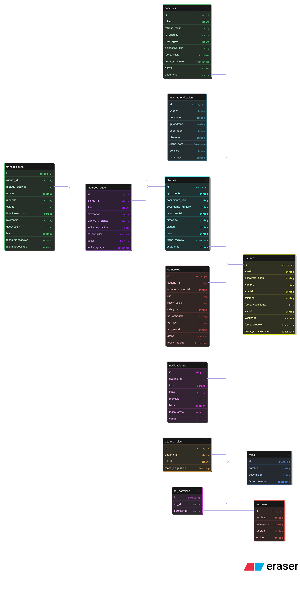

# 2. Arquitectura de Datos - Sistema Culqui

## Diagrama Entidad-Relación (ERD)

## Definición Detallada de Tablas

### 1. USUARIOS
**Propósito:** Almacenar información de todos los usuarios del sistema.

| Campo | Tipo | Restricciones | Descripción |
|-------|------|---------------|-------------|
| id | BIGINT | PK, AUTO_INCREMENT | Identificador único |
| email | VARCHAR(255) | UNIQUE, NOT NULL | Email del usuario |
| password_hash | VARCHAR(255) | NOT NULL | Contraseña hasheada con bcrypt |
| nombre | VARCHAR(100) | NOT NULL | Nombre del usuario |
| apellido | VARCHAR(100) | NOT NULL | Apellido del usuario |
| telefono | VARCHAR(20) | NULL | Teléfono de contacto |
| fecha_nacimiento | DATE | NULL | Fecha de nacimiento |
| estado | ENUM | 'activo', 'inactivo', 'bloqueado' | Estado de la cuenta |
| verificado | BOOLEAN | DEFAULT FALSE | Si el email está verificado |
| fecha_creacion | TIMESTAMP | DEFAULT CURRENT_TIMESTAMP | Fecha de registro |
| fecha_actualizacion | TIMESTAMP | ON UPDATE CURRENT_TIMESTAMP | Última actualización |

**Índices:**
- PRIMARY KEY (id)
- UNIQUE INDEX idx_email (email)
- INDEX idx_estado (estado)

---

### 2. ROLES
**Propósito:** Definir roles de usuario en el sistema.

| Campo | Tipo | Restricciones | Descripción |
|-------|------|---------------|-------------|
| id | INT | PK, AUTO_INCREMENT | Identificador único |
| nombre | VARCHAR(50) | UNIQUE, NOT NULL | Nombre del rol |
| descripcion | TEXT | NULL | Descripción del rol |
| fecha_creacion | TIMESTAMP | DEFAULT CURRENT_TIMESTAMP | Fecha de creación |

**Roles Predefinidos:**
- `super_admin`: Administrador total del sistema
- `admin`: Administrador con permisos limitados
- `comercio`: Usuario tipo comercio
- `cliente`: Cliente final
- `soporte`: Personal de soporte

---

### 3. USUARIO_ROLES
**Propósito:** Relacionar usuarios con roles (relación N:N).

| Campo | Tipo | Restricciones | Descripción |
|-------|------|---------------|-------------|
| id | BIGINT | PK, AUTO_INCREMENT | Identificador único |
| usuario_id | BIGINT | FK → usuarios(id), NOT NULL | ID del usuario |
| rol_id | INT | FK → roles(id), NOT NULL | ID del rol |
| fecha_asignacion | TIMESTAMP | DEFAULT CURRENT_TIMESTAMP | Cuándo se asignó |

**Índices:**
- PRIMARY KEY (id)
- UNIQUE INDEX idx_usuario_rol (usuario_id, rol_id)

---

### 4. PERMISOS
**Propósito:** Definir permisos granulares del sistema.

| Campo | Tipo | Restricciones | Descripción |
|-------|------|---------------|-------------|
| id | INT | PK, AUTO_INCREMENT | Identificador único |
| nombre | VARCHAR(100) | UNIQUE, NOT NULL | Nombre del permiso |
| descripcion | TEXT | NULL | Descripción |
| recurso | VARCHAR(50) | NOT NULL | Recurso (ej: 'transacciones') |
| accion | VARCHAR(50) | NOT NULL | Acción (ej: 'crear', 'leer') |

**Ejemplos de Permisos:**
- `transacciones:crear`, `transacciones:leer`, `transacciones:actualizar`
- `usuarios:gestionar`, `reportes:generar`

---

### 5. ROL_PERMISOS
**Propósito:** Relacionar roles con permisos (relación N:N).

| Campo | Tipo | Restricciones | Descripción |
|-------|------|---------------|-------------|
| id | BIGINT | PK, AUTO_INCREMENT | Identificador único |
| rol_id | INT | FK → roles(id), NOT NULL | ID del rol |
| permiso_id | INT | FK → permisos(id), NOT NULL | ID del permiso |

---

### 6. SESIONES
**Propósito:** Gestionar sesiones activas de usuarios.

| Campo | Tipo | Restricciones | Descripción |
|-------|------|---------------|-------------|
| id | BIGINT | PK, AUTO_INCREMENT | Identificador único |
| usuario_id | BIGINT | FK → usuarios(id), NOT NULL | ID del usuario |
| token | VARCHAR(500) | UNIQUE, NOT NULL | JWT token |
| refresh_token | VARCHAR(500) | UNIQUE, NOT NULL | Token de refresco |
| ip_address | VARCHAR(45) | NULL | IP del cliente |
| user_agent | TEXT | NULL | Información del navegador |
| dispositivo_tipo | ENUM | 'web', 'mobile', 'b2b' | Tipo de dispositivo |
| fecha_inicio | TIMESTAMP | DEFAULT CURRENT_TIMESTAMP | Inicio de sesión |
| fecha_expiracion | TIMESTAMP | NOT NULL | Cuándo expira |
| activa | BOOLEAN | DEFAULT TRUE | Si la sesión está activa |

**Índices:**
- PRIMARY KEY (id)
- INDEX idx_usuario_activa (usuario_id, activa)
- INDEX idx_token (token)

---

### 7. LOGS_AUTENTICACION
**Propósito:** Auditoría de todos los intentos de login.

| Campo | Tipo | Restricciones | Descripción |
|-------|------|---------------|-------------|
| id | BIGINT | PK, AUTO_INCREMENT | Identificador único |
| usuario_id | BIGINT | FK → usuarios(id), NULL | ID del usuario (null si falló) |
| evento | VARCHAR(50) | NOT NULL | 'login', 'logout', 'failed_login' |
| resultado | VARCHAR(20) | NOT NULL | 'exito', 'fallido' |
| ip_address | VARCHAR(45) | NOT NULL | IP del cliente |
| user_agent | TEXT | NULL | Información del navegador |
| ubicacion | VARCHAR(100) | NULL | País/ciudad aproximada |
| fecha_hora | TIMESTAMP | DEFAULT CURRENT_TIMESTAMP | Cuándo ocurrió |
| detalles | JSON | NULL | Información adicional |

**Índices:**
- PRIMARY KEY (id)
- INDEX idx_usuario_fecha (usuario_id, fecha_hora)
- INDEX idx_ip_fecha (ip_address, fecha_hora)

---
### 8. CLIENTES
**Propósito:** Información específica de clientes.

| Campo | Tipo | Restricciones | Descripción |
|-------|------|---------------|-------------|
| id | BIGINT | PK, AUTO_INCREMENT | Identificador único |
| usuario_id | BIGINT | FK → usuarios(id), UNIQUE, NOT NULL | Referencia a usuario |
| tipo_cliente | ENUM | 'personal', 'empresa' | Tipo de cliente |
| documento_tipo | VARCHAR(20) | NULL | 'DNI', 'RUC', 'CE' |
| documento_numero | VARCHAR(50) | NULL | Número de documento |
| razon_social | VARCHAR(255) | NULL | Para empresas |
| direccion | TEXT | NULL | Dirección |
| ciudad | VARCHAR(100) | NULL | Ciudad |
| pais | VARCHAR(50) | DEFAULT 'Perú' | País |
| fecha_registro | TIMESTAMP | DEFAULT CURRENT_TIMESTAMP | Fecha de registro |

---

### 9. METODOS_PAGO
**Propósito:** Métodos de pago asociados a clientes.

| Campo | Tipo | Restricciones | Descripción |
|-------|------|---------------|-------------|
| id | BIGINT | PK, AUTO_INCREMENT | Identificador único |
| cliente_id | BIGINT | FK → clientes(id), NOT NULL | ID del cliente |
| tipo | ENUM | 'tarjeta', 'cuenta_bancaria' | Tipo de método |
| proveedor | VARCHAR(50) | NULL | 'Visa', 'Mastercard', etc. |
| ultimos_4_digitos | VARCHAR(4) | NULL | Últimos 4 dígitos |
| fecha_expiracion | DATE | NULL | Vencimiento |
| es_principal | BOOLEAN | DEFAULT FALSE | Si es el método principal |
| activo | BOOLEAN | DEFAULT TRUE | Si está activo |
| fecha_agregado | TIMESTAMP | DEFAULT CURRENT_TIMESTAMP | Cuándo se agregó |

---

### 10. TRANSACCIONES
**Propósito:** Registro de todas las transacciones.

| Campo | Tipo | Restricciones | Descripción |
|-------|------|---------------|-------------|
| id | BIGINT | PK, AUTO_INCREMENT | Identificador único |
| cliente_id | BIGINT | FK → clientes(id), NOT NULL | Cliente que realizó |
| metodo_pago_id | BIGINT | FK → metodos_pago(id), NULL | Método usado |
| monto | DECIMAL(12,2) | NOT NULL | Monto de la transacción |
| moneda | VARCHAR(3) | DEFAULT 'PEN' | 'PEN', 'USD', etc. |
| estado | ENUM | 'pendiente', 'completada', 'fallida', 'reembolsada' | Estado |
| tipo_transaccion | ENUM | 'pago', 'reembolso', 'transferencia' | Tipo |
| referencia | VARCHAR(100) | UNIQUE | Código de referencia |
| descripcion | TEXT | NULL | Descripción |
| fee | DECIMAL(12,2) | DEFAULT 0.00 | Comisión |
| fecha_transaccion | TIMESTAMP | DEFAULT CURRENT_TIMESTAMP | Cuándo se creó |
| fecha_procesado | TIMESTAMP | NULL | Cuándo se procesó |

---

### 11. COMERCIOS
**Propósito:** Información de comercios que usan Culqui.

| Campo | Tipo | Restricciones | Descripción |
|-------|------|---------------|-------------|
| id | BIGINT | PK, AUTO_INCREMENT | Identificador único |
| usuario_id | BIGINT | FK → usuarios(id), UNIQUE, NOT NULL | Usuario del comercio |
| nombre_comercial | VARCHAR(255) | NOT NULL | Nombre del comercio |
| ruc | VARCHAR(11) | UNIQUE, NOT NULL | RUC del comercio |
| razon_social | VARCHAR(255) | NOT NULL | Razón social |
| categoria | VARCHAR(100) | NULL | Categoría del negocio |
| url_webhook | VARCHAR(255) | NULL | URL para notificaciones |
| api_key | VARCHAR(255) | UNIQUE, NOT NULL | Clave API |
| api_secret | VARCHAR(255) | NOT NULL | Secret hasheado |
| activo | BOOLEAN | DEFAULT TRUE | Si está activo |
| fecha_registro | TIMESTAMP | DEFAULT CURRENT_TIMESTAMP | Fecha de registro |

---

### 12. NOTIFICACIONES
**Propósito:** Sistema de notificaciones para usuarios.

| Campo | Tipo | Restricciones | Descripción |
|-------|------|---------------|-------------|
| id | BIGINT | PK, AUTO_INCREMENT | Identificador único |
| usuario_id | BIGINT | FK → usuarios(id), NOT NULL | Usuario destinatario |
| tipo | VARCHAR(50) | NOT NULL | 'login', 'transaccion', 'alerta' |
| titulo | VARCHAR(255) | NOT NULL | Título de notificación |
| mensaje | TEXT | NOT NULL | Contenido |
| leida | BOOLEAN | DEFAULT FALSE | Si fue leída |
| fecha_envio | TIMESTAMP | DEFAULT CURRENT_TIMESTAMP | Cuándo se envió |
| canal | ENUM | 'email', 'sms', 'push', 'sistema' | Canal de envío |

---

## Relaciones entre Tablas

1. **usuarios** ↔ **usuario_roles** ↔ **roles** (N:N)
2. **roles** ↔ **rol_permisos** ↔ **permisos** (N:N)
3. **usuarios** → **sesiones** (1:N)
4. **usuarios** → **logs_autenticacion** (1:N)
5. **usuarios** → **clientes** (1:1)
6. **usuarios** → **comercios** (1:1)
7. **clientes** → **metodos_pago** (1:N)
8. **clientes** → **transacciones** (1:N)
9. **metodos_pago** → **transacciones** (1:N)
10. **usuarios** → **notificaciones** (1:N)

---

## Script de Creación (SQL)

Ver archivo: `2-arquitectura-datos/schema.sql`
