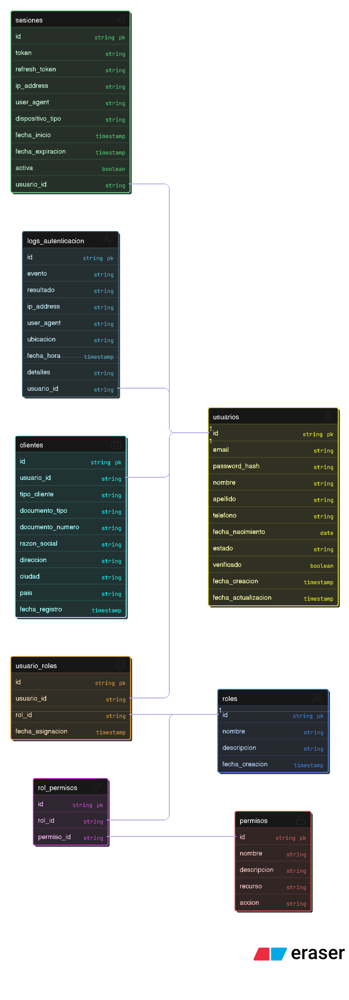

# 3. Arquitectura de Servicios - Login Culqui
---

## Tablas Necesarias para el Login

### 1. USUARIOS (Tabla Principal)
**Propósito:** Almacenar credenciales y datos básicos del usuario.

**Campos utilizados en el login:**
```sql
- id              → Identificador único del usuario
- email           → Credencial de acceso (username)
- password_hash   → Contraseña hasheada con bcrypt
- estado          → Verificar si puede iniciar sesión
- verificado      → Verificar si el email está confirmado
```

**Uso en el proceso de autenticación:**
1. El usuario envía `email` y `password`
2. El sistema busca en la tabla: `SELECT * FROM usuarios WHERE email = ?`
3. Compara el password ingresado con `password_hash` usando bcrypt
4. Verifica que `estado = 'activo'` y `verificado = TRUE`

**Query de ejemplo:**
```sql
SELECT
    u.id,
    u.email,
    u.password_hash,
    u.nombre,
    u.apellido,
    u.estado,
    u.verificado
FROM usuarios u
WHERE u.email = 'usuario@ejemplo.com'
AND u.estado = 'activo';
```

---

### 2. USUARIO_ROLES (Relación Usuario-Rol)
**Propósito:** Determinar qué roles tiene el usuario autenticado.

**Campos utilizados:**
```sql
- usuario_id  → Relacionar con el usuario que inicia sesión
- rol_id      → Identificar qué rol(es) tiene
```

**Uso en el proceso de autenticación:**
1. Después de validar credenciales, se obtienen los roles del usuario
2. Los roles determinan qué puede hacer en el sistema

**Query de ejemplo:**
```sql
SELECT
    r.id as rol_id,
    r.nombre as rol_nombre
FROM usuario_roles ur
INNER JOIN roles r ON ur.rol_id = r.id
WHERE ur.usuario_id = 123;
```

---

### 3. ROLES
**Propósito:** Definir el tipo de usuario (cliente, comercio, admin, etc.).

**Campos utilizados:**
```sql
- id          → Identificador del rol
- nombre      → Nombre del rol ('cliente', 'comercio', etc.)
- descripcion → Descripción del rol
```

**Uso en el proceso de autenticación:**
1. Se incluye en el JWT generado
2. El frontend usa el rol para mostrar/ocultar funcionalidades
3. El backend usa el rol para autorizar acciones

---

### 4. ROL_PERMISOS + PERMISOS
**Propósito:** Definir permisos específicos del usuario para autorización.

**Uso en el proceso de autenticación:**
1. Después de obtener roles, se obtienen permisos asociados
2. Los permisos se incluyen en el JWT o se validan en cada request

**Query de ejemplo:**
```sql
SELECT DISTINCT
    p.id,
    p.nombre,
    p.recurso,
    p.accion
FROM usuario_roles ur
INNER JOIN rol_permisos rp ON ur.rol_id = rp.rol_id
INNER JOIN permisos p ON rp.permiso_id = p.id
WHERE ur.usuario_id = 123;
```

---

### 5. SESIONES
**Propósito:** Gestionar sesiones activas del usuario.

**Campos utilizados:**
```sql
- usuario_id          → Usuario que inició sesión
- token               → JWT generado
- refresh_token       → Token para renovar sesión
- ip_address          → IP desde donde se conectó
- user_agent          → Navegador/dispositivo
- dispositivo_tipo    → web, mobile, b2b
- fecha_inicio        → Cuándo inició sesión
- fecha_expiracion    → Cuándo expira el token
- activa              → Si la sesión sigue activa
```

**Uso en el proceso de autenticación:**
1. Al hacer login exitoso, se crea un registro en `sesiones`
2. Se genera JWT y refresh_token
3. Se almacena información del dispositivo para auditoría
4. Permite cerrar sesión remotamente (setear `activa = FALSE`)

**Insert de ejemplo:**
```sql
INSERT INTO sesiones (
    usuario_id,
    token,
    refresh_token,
    ip_address,
    user_agent,
    dispositivo_tipo,
    fecha_expiracion
) VALUES (
    123,
    'eyJhbGciOiJIUzI1NiIsInR5cCI6IkpXVCJ9...',
    'refresh_token_hash...',
    '192.168.1.1',
    'Mozilla/5.0...',
    'web',
    DATE_ADD(NOW(), INTERVAL 1 HOUR)
);
```

---

### 6. LOGS_AUTENTICACION
**Propósito:** Auditoría de intentos de login (exitosos y fallidos).

**Campos utilizados:**
```sql
- usuario_id   → Usuario que intentó login (NULL si falló)
- evento       → 'login', 'logout', 'failed_login'
- resultado    → 'exito', 'fallido'
- ip_address   → IP del intento
- user_agent   → Navegador/dispositivo
- ubicacion    → Geolocalización aproximada
- fecha_hora   → Timestamp del evento
- detalles     → JSON con info adicional
```

**Uso en el proceso de autenticación:**
1. **SIEMPRE** se registra cada intento de login
2. Permite detectar intentos de fuerza bruta
3. Alertar al usuario de logins sospechosos
4. Análisis forense en caso de hackeo

**Insert de ejemplo (login exitoso):**
```sql
INSERT INTO logs_autenticacion (
    usuario_id,
    evento,
    resultado,
    ip_address,
    user_agent,
    ubicacion,
    detalles
) VALUES (
    123,
    'login',
    'exito',
    '192.168.1.1',
    'Mozilla/5.0...',
    'Lima, Perú',
    '{"dispositivo": "web", "navegador": "Chrome"}'
);
```

**Insert de ejemplo (login fallido):**
```sql
INSERT INTO logs_autenticacion (
    usuario_id,
    evento,
    resultado,
    ip_address,
    user_agent,
    detalles
) VALUES (
    NULL,  -- No sabemos qué usuario porque falló
    'failed_login',
    'fallido',
    '192.168.1.1',
    'Mozilla/5.0...',
    '{"razon": "credenciales_invalidas", "email_intentado": "usuario@ejemplo.com"}'
);
```
## Flujo de Datos en el Proceso de Login

### Paso 1: Validación Inicial
```
INPUT: { email, password }
  ↓
CHECK
  ↓ (si no está bloqueado)
QUERY: usuarios WHERE email = ?
```

### Paso 2: Autenticación
```
COMPARE: bcrypt.compare(password, password_hash)
  ↓ (si coincide)
VALIDATE: estado = 'activo' AND verificado = TRUE
  ↓ (si es válido)
CONTINUE
```

### Paso 3: Obtener Roles y Permisos
```
QUERY: usuario_roles → roles
  ↓
QUERY: rol_permisos → permisos
  ↓
BUILD: Array de roles y permisos
```

### Paso 4: Crear Sesión
```
GENERATE: token
  ↓
INSERT: sesiones (token, refresh_token, etc.)
  ↓
INSERT: logs_autenticacion (evento='login', resultado='exito')
```

### Paso 5: Respuesta
```
RETURN: {
  token,
  refreshToken,
  usuario: { id, nombre, email, roles, permisos }
}
```

---

## Consultas SQL Completas para Login

### Query Principal de Autenticación
```sql
-- 1. Obtener datos del usuario
SELECT
    u.id,
    u.email,
    u.password_hash,
    u.nombre,
    u.apellido,
    u.estado,
    u.verificado,
    GROUP_CONCAT(DISTINCT r.nombre) as roles,
    GROUP_CONCAT(DISTINCT p.nombre) as permisos
FROM usuarios u
LEFT JOIN usuario_roles ur ON u.id = ur.usuario_id
LEFT JOIN roles r ON ur.rol_id = r.id
LEFT JOIN rol_permisos rp ON r.id = rp.rol_id
LEFT JOIN permisos p ON rp.permiso_id = p.id
WHERE u.email = ?
AND u.estado = 'activo'
GROUP BY u.id;

-- 2. Crear sesión
INSERT INTO sesiones (
    usuario_id, token, refresh_token,
    ip_address, user_agent, dispositivo_tipo,
    fecha_expiracion
) VALUES (?, ?, ?, ?, ?, ?, ?);

-- 3. Registrar log de autenticación
INSERT INTO logs_autenticacion (
    usuario_id, evento, resultado,
    ip_address, user_agent, ubicacion, detalles
) VALUES (?, 'login', 'exito', ?, ?, ?, ?);
```

---

## Datos Incluidos en el JWT

```javascript
{
  // Header
  "alg": "HS256",
  "typ": "JWT",

  // Payload
  "sub": 123,                    // usuario.id
  "email": "usuario@ejemplo.com",
  "nombre": "Juan Pérez",
  "roles": ["cliente"],
  "permisos": [
    "transacciones:crear",
    "transacciones:leer",
    "dashboard:ver"
  ],
  "iat": 1699999999,            // Issued at
  "exp": 1700003599,            // Expiration (1 hora)
  "tipo_dispositivo": "web"
}
```

---

## Resumen de Uso de Tablas en Login

| Tabla | Lectura | Escritura | Propósito en Login |
|-------|---------|-----------|-------------------|
| **usuarios** | ✓ | - | Validar credenciales |
| **usuario_roles** | ✓ | - | Obtener roles |
| **roles** | ✓ | - | Identificar tipo de usuario |
| **rol_permisos** | ✓ | - | Obtener permisos |
| **permisos** | ✓ | - | Detalles de permisos |
| **sesiones** | - | ✓ | Crear sesión activa |
| **logs_autenticacion** | - | ✓ | Auditoría de login |

---

## Optimizaciones de Consultas

### 1. Índices Críticos
```sql
-- En tabla usuarios
INDEX idx_email (email);
INDEX idx_estado (estado);

-- En tabla sesiones
INDEX idx_usuario_activa (usuario_id, activa);
INDEX idx_token (token);

```

### 2. Caché (Recomendado)
- **Redis:** Almacenar sesiones activas para acceso rápido
- **Memcached:** Cachear roles y permisos de usuarios frecuentes
- **TTL:** 15 minutos para datos de usuario

### 3. Procedimiento Almacenado (Opcional)
```sql
DELIMITER //
CREATE PROCEDURE sp_login(
    IN p_email VARCHAR(255),
    IN p_ip VARCHAR(45)
)
BEGIN
    DECLARE v_bloqueado BOOLEAN;
    //
DELIMITER ;
```

---

## Diagrama de Flujo de Datos


